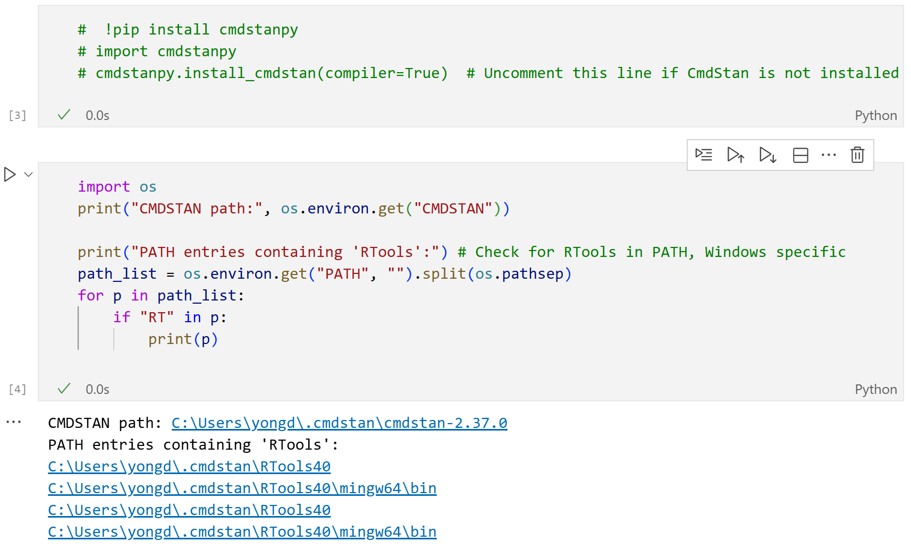

# cmdstanpy install and setup
- Run the commands in a cell in jupyter notebook.
- Comment out first!

- The command `cmdstanpy.install_cmdstan(compiler=True)` downloads, and build up cmdstanpy as well as `Stan` system. In Windows 10/11, `RTools40` will be downloaded. It may take quite long (like 30 minutes) in some case.
- In MacOS, you must install `XCode` for various command line tools. `cmdstanpy.install_cmdstan(compiler=True)` will not install a compiler (`RTools40`) system. Instead, system compiler c++, clang++, etc will be used and they are installed when `XCode` is installed.

# Environment Path Setting

# Jupyter Notebooks

1. After installation, re-rerun `vscode`
2. open `mcmc_beta_bernoulli.ipynb`
    - press RunAll to see if the installation was completed.

    - it is about bernoulli experiment with beta prior

3. `mcmc_cmdstanpy.ipynb`: Bayesian analysis for randomized response technique.
    - three more files in `RRT` directory.

4. `RRT/coin_misclass_strong_prior_ROPE_BF.ipynb`
    - A BF2 problem about using a vision system for tossing a coin multiple times to find out $\theta=Pr[앞면]$
